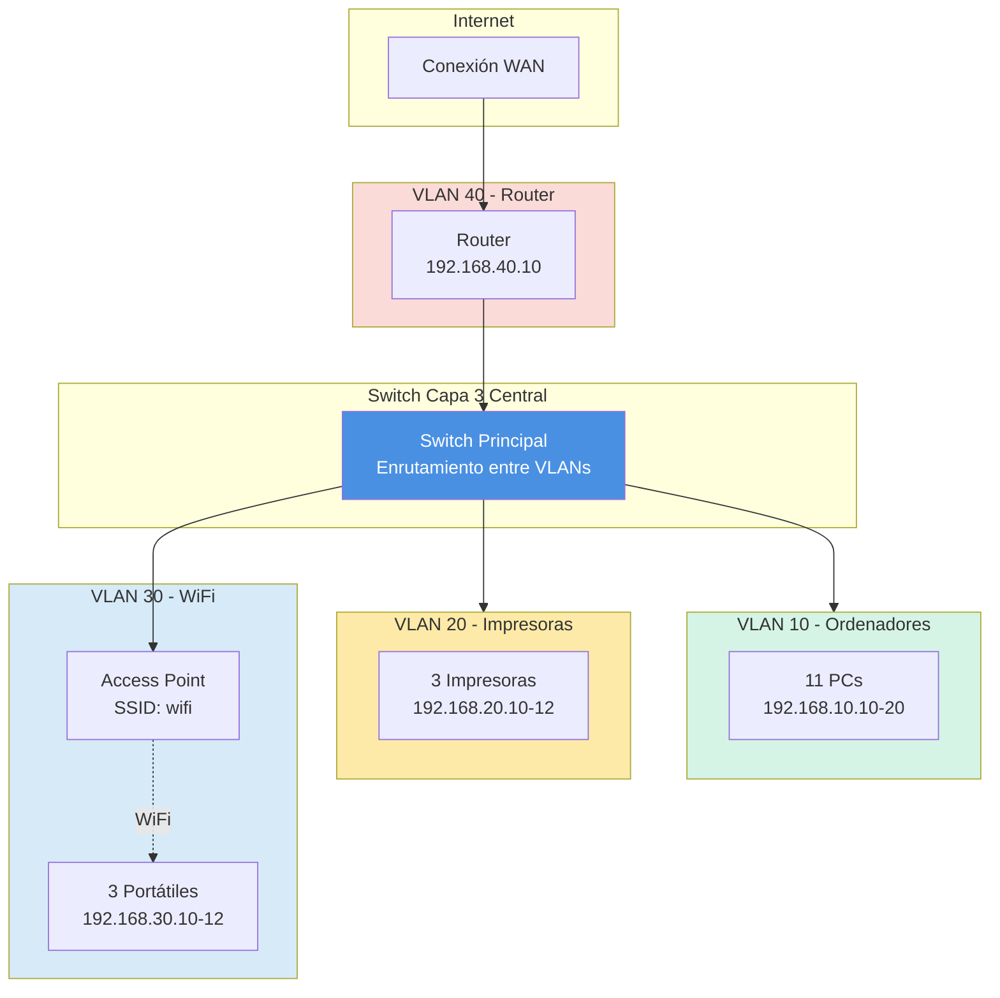
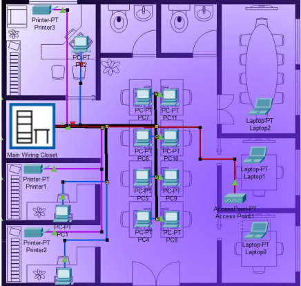

# Simulación de Red para Empresa Mediana

## Presentación del Proyecto

Este es mi proyecto final de **Laboratorio Integral de Redes de Datos** donde he creado una simulación completa de red empresarial usando **Cisco Packet Tracer**.

La idea era diseñar una red mediana que estuviera bien segmentada y organizada, simulando lo que sería una empresa real con diferentes departamentos y necesidades.

!!! info "Datos del Proyecto"
    **Autor:** Nerea Fdez Fernández  
    **Fecha:** 15/01/2026  
    **Herramienta:** Cisco Packet Tracer  
    **Objetivo:** Crear una red segmentada con VLANs, seguridad y monitorización

---

## ¿Qué he hecho en este proyecto?

Se ha montado una red completa con:

-  **11 ordenadores** para usuarios
-  **3 impresoras** de red
-  **3 portátiles** conectados por WiFi
-  **1 Access Point** para la red inalámbrica
-  **1 Switch de Capa 3** (el cerebro de la red)
-  **1 Router** para salida a internet

Todo conectado con cables directos RJ45 y WiFi para los portátiles.

---

## Topología de la Red

Se ha usado una **topología en estrella** con el switch de capa 3 en el centro. Esto significa que todos los dispositivos se conectan a un punto central (el switch), lo que hace muy fácil gestionar y arreglar problemas.

**Vista de la Topología:**

---

## División en VLANs

Para organizar mejor la red, he dividido todo en **4 VLANs** (redes virtuales):

| VLAN | Nombre | Para qué sirve | Red |
|------|--------|----------------|-----|
| **VLAN 10** | Ordenadores | Los PCs de los trabajadores | 192.168.10.0/24 |
| **VLAN 20** | Impresoras | Las impresoras de red | 192.168.20.0/24 |
| **VLAN 30** | Punto Acceso| Portátiles conectados por WiFi | 192.168.30.0/24 |
| **VLAN 40** | Router | Conexión al router de salida | 192.168.40.0/24 |

!!! tip "¿Por qué usar VLANs?"
    Separar la red en VLANs me permite:
    
    -  Tener más **seguridad** (los invitados WiFi no pueden acceder a todo)
    -  Mejor **rendimiento** (menos tráfico innecesario)
    -  Más fácil de **gestionar** y arreglar problemas

---

## Dispositivos y Conexiones

### Equipos que he usado:

=== "VLAN 10 - PCs"
    **11 ordenadores** para los trabajadores
    
    - IPs: desde 192.168.10.10 hasta 192.168.10.20
    - Gateway: 192.168.10.1
    - Máscara: 255.255.255.0
    - Puertos del switch: FastEthernet 0/1 - 0/11

=== "VLAN 20 - Impresoras"
    **3 impresoras** de red
    
    - IP fijas: 192.168.20.10, .11 y .12
    - Gateway: 192.168.20.1
    - Máscara: 255.255.255.0
    - Puertos del switch: FastEthernet 0/12 - 0/14

=== "VLAN 30 - WiFi"
    **1 Access Point + 3 Portátiles**
    
    - **Access Point:** Puerto Fa0/15 del switch
    - **SSID:** wifi
    - **Seguridad:** WPA2-PSK
    - **Password:** prueba1234
    - **Portátiles:** IPs 192.168.30.10, .11 y .12
    - **Gateway:** 192.168.30.1

=== "VLAN 40 - Router"
    **1 Router** para internet
    
    - IP del router: 192.168.40.10
    - IP del switch: 192.168.40.1
    - Puerto: GigabitEthernet 0/1

---

## Características Principales

Se ha implementado varias cosas importantes para que la red funcione bien:

### Enrutamiento entre VLANs
El switch de capa 3 permite que las diferentes VLANs se comuniquen entre sí (cuando está permitido).

### Seguridad con ACLs
Se ha puesto listas de control de acceso (ACLs) para que:

- ❌ Los portátiles WiFi **NO** puedan acceder a los PCs (VLAN 10)
- ❌ Los portátiles WiFi **NO** puedan acceder a las impresoras (VLAN 20)
- ✅ Pero **SÍ** puedan salir a internet

Esto está por seguridad, ya que el WiFi podría ser usado por alguien externo (invitado)

### Seguridad de Puertos
Se ha configurado que solo un número limitado de dispositivos puedan conectarse a cada puerto del switch.

### Spanning Tree Protocol (STP)
Se ha configurado para evitar bucles en la red y que funcione todo correctamente.

### Monitorización SNMP
Se ha activado SNMP en el router para poder monitorizar el estado de la red (ver si está encendido, cuánto tiempo lleva funcionando, etc.).

---

## Navegación de la Documentación

En las siguientes páginas explico todo el proceso paso a paso:

- **[Configuración de Red](configuracion.md)** - Cómo configurar las VLANs, IPs y dispositivos
- **[Seguridad y ACLs](seguridad.md)** - Las medidas de seguridad a implementar
- **[Pruebas y Monitorización](pruebas.md)** - Cómo comprobar que todo funciona
- **[Conclusiones](conclusiones.md)** - Lo que aprendí y posibles mejoras

---

!!! quote "Mi Experiencia"
    Este proyecto me ha servido para entender cómo se monta una red real de empresa. Hay que entender como funcionan las VLANs y las ACLs, pero una vez lo entiendes, es fácil de trabajar. Lo más complicado fue hacer que el WiFi funcionara con las ACLs correctamente configuradas.

---

**¡Como se montó todo!** 👇
