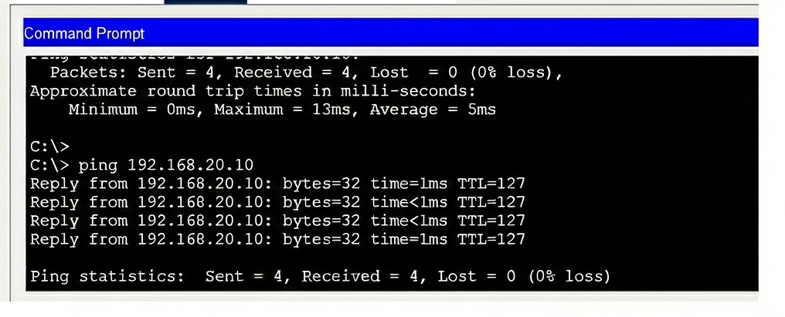

# Pruebas y Monitorización

Una vez que esté todo configurado, el siguiente paso será hacer pruebas para comprobar que la red funciona correctamente y que las ACLs bloqueaban lo que tenían que bloquear.

---

## Pruebas de Conectividad con Ping

El comando más útil para probar redes es **`ping`**. Se usará desde los diferentes dispositivos para ver si pueden comunicarse.

### Pruebas Exitosas ✅

Primero comprobaremos que es lo que **SÍ debería funcionar**:

=== "PC a PC (misma VLAN)"

    Desde **PC0** (192.168.10.10) hice ping a **PC1** (192.168.10.11):
    
    ```
    C:\> ping 192.168.10.11
    
    Reply from 192.168.10.11: bytes=32 time<1ms TTL=128
    Reply from 192.168.10.11: bytes=32 time<1ms TTL=128
    Reply from 192.168.10.11: bytes=32 time<1ms TTL=128
    Reply from 192.168.10.11: bytes=32 time<1ms TTL=128
    
    Ping statistics: Sent = 4, Received = 4, Lost = 0 (0% loss)
    ```
    
    **Funciona perfecto** - Los PCs de la misma VLAN se comunican sin problemas.

    

=== "PC a Impresora (diferente VLAN)"

    Desde **PC0** (192.168.10.10) hice ping a **Impresora0** (192.168.20.10):
    
    ```
    C:\> ping 192.168.20.10
    
    Reply from 192.168.20.10: bytes=32 time=1ms TTL=127
    Reply from 192.168.20.10: bytes=32 time<1ms TTL=127
    Reply from 192.168.20.10: bytes=32 time<1ms TTL=127
    Reply from 192.168.20.10: bytes=32 time=1ms TTL=127
    
    Ping statistics: Sent = 4, Received = 4, Lost = 0 (0% loss)
    ```
    
     **Funciona** - El enrutamiento entre VLANs está bien configurado. El TTL=127 indica que pasó por el switch (1 salto).
     
     

=== "PC a Router"

    Desde **PC0** (192.168.10.10) hice ping al **Router** (192.168.40.10):
    
    ```
    C:\> ping 192.168.40.10
    
    Reply from 192.168.40.10: bytes=32 time=1ms TTL=254
    Reply from 192.168.40.10: bytes=32 time=1ms TTL=254
    Reply from 192.168.40.10: bytes=32 time<1ms TTL=254
    Reply from 192.168.40.10: bytes=32 time=1ms TTL=254
    
    Ping statistics: Sent = 4, Received = 4, Lost = 0 (0% loss)
    ```
    
     **Funciona** - Todos pueden acceder al router.
     
     

---

### Pruebas con ACL (Bloqueadas) 

Ahora viene lo importante: comprobar que las ACLs **SÍ están bloqueando** lo que no debería pasar.

=== "Portátil WiFi → PC (BLOQUEADO)"

    Desde **Laptop0** (192.168.30.10) intenté hacer ping a **PC0** (192.168.10.10):
    
    ```
    C:\> ping 192.168.10.10
    
    Request timed out.
    Request timed out.
    Request timed out.
    Request timed out.
    
    Ping statistics: Sent = 4, Received = 0, Lost = 4 (100% loss)
    ```
    
    **BLOQUEADO** - ¡Perfecto! La ACL está funcionando. El portátil WiFi NO puede acceder a los PCs.

=== "Portátil WiFi → Impresora (BLOQUEADO)"

    Desde **Laptop0** (192.168.30.10) intenté hacer ping a **Impresora0** (192.168.20.10):
    
    ```
    C:\> ping 192.168.20.10
    
    Request timed out.
    Request timed out.
    Request timed out.
    Request timed out.
    
    Ping statistics: Sent = 4, Received = 0, Lost = 4 (100% loss)
    ```
    
     **BLOQUEADO** - También funciona. El WiFi no puede acceder a las impresoras.

=== "Portátil WiFi → Router (PERMITIDO)"

    Desde **Laptop0** (192.168.30.10) hice ping al **Router** (192.168.40.10):
    
    ```
    C:\> ping 192.168.40.10
    
    Reply from 192.168.40.10: bytes=32 time=2ms TTL=254
    Reply from 192.168.40.10: bytes=32 time=1ms TTL=254
    Reply from 192.168.40.10: bytes=32 time=1ms TTL=254
    Reply from 192.168.40.10: bytes=32 time=2ms TTL=254
    
    Ping statistics: Sent = 4, Received = 4, Lost = 0 (0% loss)
    ```
    
     **Funciona** - El WiFi SÍ puede acceder al router (y por tanto a internet). Esto es lo que quería.

---

## Tabla Resumen de Pruebas

| Origen | Destino | IP Destino | Resultado | Motivo |
|--------|---------|------------|-----------|--------|
| PC0 | PC1 | 192.168.10.11 | ✅ Funciona | Misma VLAN |
| PC0 | Impresora0 | 192.168.20.10 | ✅ Funciona | Enrutamiento Inter-VLAN |
| PC0 | Router | 192.168.40.10 | ✅ Funciona | Sin restricciones |
| Laptop0 | PC0 | 192.168.10.10 | ❌ Bloqueado | ACL 100 deny |
| Laptop0 | Impresora0 | 192.168.20.10 | ❌ Bloqueado | ACL 100 deny |
| Laptop0 | Router | 192.168.40.10 | ✅ Funciona | ACL permite |

!!! success "¡Todo funciona como esperaba!"
    Las ACLs están haciendo su trabajo correctamente. Los portátiles WiFi no pueden acceder a recursos internos, pero sí al router.

---

## Pruebas Bidireccionales

También hay que comprobar que los **PCs SÍ pueden hacer ping a los portátiles**. La ACL solo bloquea en una dirección (desde VLAN 30 hacia fuera):

Desde **PC0** (192.168.10.10) a **Laptop0** (192.168.30.10):

```
C:\> ping 192.168.30.10

Reply from 192.168.30.10: bytes=32 time=2ms TTL=127
Reply from 192.168.30.10: bytes=32 time=1ms TTL=127
Reply from 192.168.30.10: bytes=32 time=2ms TTL=127
Reply from 192.168.30.10: bytes=32 time=1ms TTL=127

Ping statistics: Sent = 4, Received = 4, Lost = 0 (0% loss)
```

Funciona. Esto es útil porque los administradores (desde los PCs) sí pueden gestionar los dispositivos WiFi si hace falta.

---

## Monitorización con SNMP

Para poder supervisar el estado de la red, se deberá configurar **SNMP** en el router. SNMP permite ver información como:

- Tiempo que lleva encendido el router
- Nombre del dispositivo
- Configuración actual
- Estados de las interfaces

### Configuración de SNMP en el Router

```cisco
RouterPrincipal> enable
RouterPrincipal# configure terminal

! Configurar información de contacto
RouterPrincipal(config)# snmp-server contact Nerea Fernandez
RouterPrincipal(config)# snmp-server location Sala Servidores

! Configurar "community strings" (como passwords)
RouterPrincipal(config)# snmp-server community read RO
RouterPrincipal(config)# snmp-server community write RW

! Activar el servidor SNMP
RouterPrincipal(config)# snmp-server enable traps

RouterPrincipal(config)# exit
RouterPrincipal# write memory
```

!!! info "Community Strings"
    - **read (RO)** = Read Only (solo lectura) - Para consultar información
    - **write (RW)** = Read-Write (lectura y escritura) - Para hacer cambios remotos

---

### Probando SNMP desde un PC

Para probar SNMP, desde **PC0** (192.168.10.10) abrí el **MIB Browser** (en Desktop):

1. Fui a **Advanced**
2. Configuré:
   - **IP:** 192.168.40.10 (el router)
   - **Puerto:** 161 (puerto por defecto de SNMP)
   - **Read Community:** read
   - **Write Community:** write

3. En **SNMP MIBs** → **system** → **sysName**
   - Me salió el OID del router (identificación única)
   - También pude ver el tiempo de encendido (uptime)


---

### ¿Qué información puedes ver con SNMP?

Con el MIB Browser pude consultar:

| Información | OID | Descripción |
|-------------|-----|-------------|
| **sysName** | 1.3.6.1.2.1.1.5.0 | Nombre del router |
| **sysUpTime** | 1.3.6.1.2.1.1.3.0 | Tiempo encendido |
| **sysContact** | 1.3.6.1.2.1.1.4.0 | Contacto (Nerea Fernandez) |
| **sysLocation** | 1.3.6.1.2.1.1.6.0 | Ubicación (Sala Servidores) |

!!! tip "Para qué sirve SNMP"
    En una red real, podrías usar un software de monitorización (como Zabbix o PRTG) que consulta SNMP automáticamente y te avisa si algo va mal (por ejemplo, si el router se apaga).

---

## Verificación de Spanning Tree

Para comprobar que STP está funcionando:

```cisco
SwitchCapa3# show spanning-tree brief

VLAN0010
  Spanning tree enabled protocol ieee
  Root ID    Priority    24576
             This bridge is the root

VLAN0020
  Spanning tree enabled protocol ieee
  Root ID    Priority    24576
             This bridge is the root

...
```

Como dice "This bridge is the root", significa que el switch es la raíz de todas las VLANs, tal como se configuró.

---

## Verificación de Port-Security

Para ver si port-security está activo:

```cisco
SwitchCapa3# show port-security

Secure Port  MaxSecureAddr  CurrentAddr  SecurityViolation  Security Action
-----------------------------------------------------------------------------
Fa0/1        1              1            0                  Shutdown
...
```

Esto me dice:

- Puerto Fa0/1 está asegurado
- Máximo 1 dispositivo permitido
- Actualmente hay 1 conectado
- No ha habido violaciones de seguridad

---

## Comandos Útiles para Verificación

Estos son los comandos que más usé para comprobar que todo estaba bien:

```cisco
! Ver las VLANs y sus puertos
show vlan brief

! Ver las IPs de las interfaces VLAN
show ip interface brief

! Ver la tabla de rutas
show ip route

! Ver las ACLs configuradas
show access-lists

! Ver tabla MAC  show mac address-table

! Ver estado de STP
show spanning-tree

! Ver port-security
show port-security interface fa0/1
```

---

!!! success "Todas las pruebas pasadas"
    Después de todas estas pruebas, puedo confirmar que:
    
    -  La red funciona correctamente
    -  Las VLANs están bien configuradas
    -  El enrutamiento Inter-VLAN funciona
    -  Las ACLs bloquean lo que tienen que bloquear
    -  SNMP está operativo
    -  STP está activo
    -  Port-security está configurada

**Siguiente:** [Conclusiones →](conclusiones.md)
