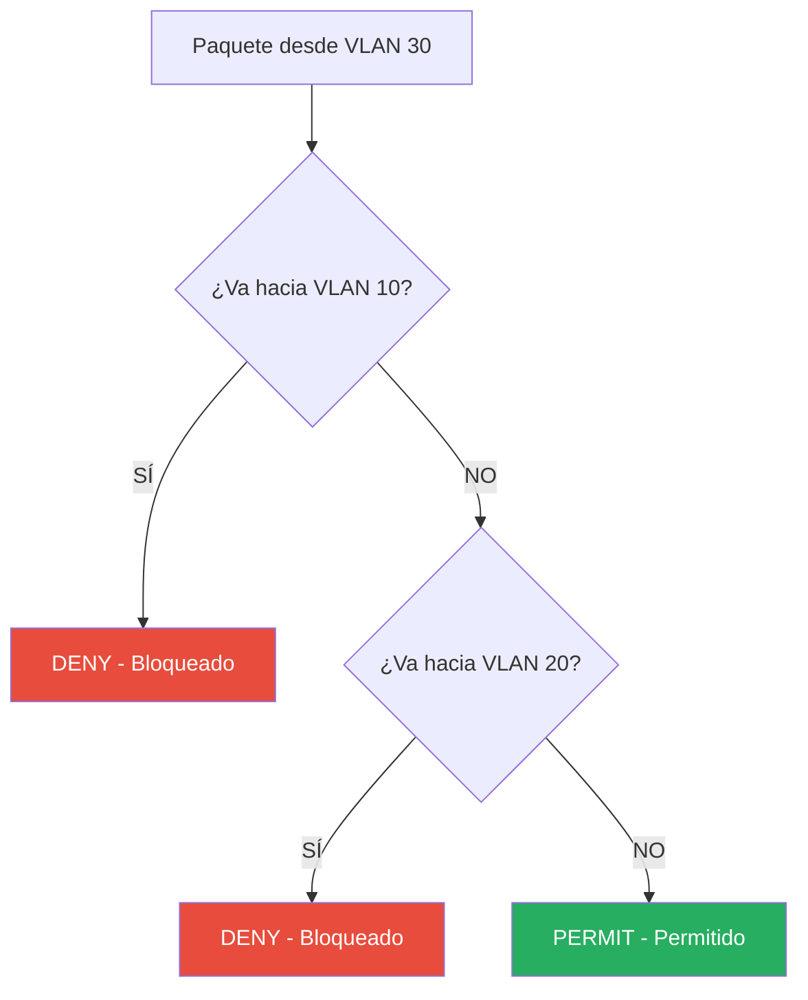

# Seguridad de la Red

Una vez que toda la red este montada y funcionando, el siguiente paso será añadir seguridad. Aquí explico las medidas de seguridad que implementé.

---

## ¿Por qué necesitamos seguridad?

Aunque la red ya funcionaba, había un problema: **cualquier dispositivo podía acceder a cualquier otro**. Por ejemplo, un portátil conectado al WiFi (que podría ser de un invitado) podría acceder a los ordenadores de la empresa o a las impresoras.

Esto no es seguro, así que tenía que restringir algunos accesos.

---

## Listas de Control de Acceso (ACLs)

Las **ACLs** son como filtros que permiten o bloquean tráfico de red según reglas que tú defines. Muy útil para la seguridad.

### Mi objetivo con las ACLs

Objetivo a conseguir:

- ❌ **Bloquear** que los portátiles WiFi (VLAN 30) accedan a los PCs (VLAN 10)
- ❌ **Bloquear** que los portátiles WiFi (VLAN 30) accedan a las impresoras (VLAN 20)
- ✅ **Permitir** que todo el mundo pueda ver el router (VLAN 40)
- ✅ **Permitir** que los PCs e impresoras se comuniquen entre ellos

!!! warning "Motivo de seguridad"
    Como el WiFi podría usarlo gente de fuera (invitados, visitas), no deberían tener acceso a recursos internos de la empresa como los ordenadores o impresoras.

---

## Configuración de las ACLs

Para ello,se creó una **ACL extendida** (que permite filtrar con más detalle):

```cisco
SwitchCapa3> enable
SwitchCapa3# configure terminal

! Crear la ACL número 100
! Bloquear VLAN 30 hacia VLAN 10
SwitchCapa3(config)# access-list 100 deny ip 192.168.30.0 0.0.0.255 192.168.10.0 0.0.0.255

! Bloquear VLAN 30 hacia VLAN 20
SwitchCapa3(config)# access-list 100 deny ip 192.168.30.0 0.0.0.255 192.168.20.0 0.0.0.255

! Permitir todo lo demás
SwitchCapa3(config)# access-list 100 permit ip any any

! Aplicar la ACL a la interfaz de VLAN 30 (entrada)
SwitchCapa3(config)# interface vlan 30
SwitchCapa3(config-if)# ip access-group 100 in
SwitchCapa3(config-if)# exit

SwitchCapa3(config)# exit
SwitchCapa3# write memory
```

!!! note "Explicación de los comandos"
    - `access-list 100 deny ip...` → Bloquea el tráfico
    - `192.168.30.0 0.0.0.255` → Cualquier IP de la red WiFi
    - `192.168.10.0 0.0.0.255` → Cualquier IP de la red de PCs
    - `permit ip any any` → Permite todo lo demás (importante ponerlo)
    - `ip access-group 100 in` → Aplica la ACL en la entrada de VLAN 30

---

## ¿Cómo funcionan las ACLs?

Las ACLs se leen **de arriba hacia abajo**. Cuando un paquete llega:

1. Se comprueba la **primera regla**
   - Si coincide → se aplica (deny o permit) y se para
   - Si no coincide → pasa a la siguiente regla

2. Se comprueba la **segunda regla**
   - Y así sucesivamente...

3. Si no coincide con ninguna → se **bloquea por defecto**

Por eso es importante poner `permit ip any any` al final, para permitir todo lo que no hemos bloqueado específicamente.



**Representación visual del bloqueo:**


---

## Seguridad de Puertos

Además de las ACLs, también se configuró **port-security** en algunos puertos del switch. Esto limita cuántos dispositivos pueden conectarse a cada puerto.

Por ejemplo, si se configura un puerto para que solo acepte 1 dispositivo, si alguien intenta conectar un segundo, el puerto se bloquea automáticamente.

### Configuración de Port-Security

```cisco
! Ejemplo con el puerto Fa0/1 (PC0)
SwitchCapa3(config)# interface fastEthernet 0/1
SwitchCapa3(config-if)# switchport port-security
SwitchCapa3(config-if)# switchport port-security maximum 1
SwitchCapa3(config-if)# switchport port-security violation shutdown
SwitchCapa3(config-if)# exit
```

### Verificar Port-Security

Para comprobar que funciona:

```cisco
SwitchCapa3# show port-security interface fastEthernet 0/1
```

Esto me muestra:

- Número máximo de MACs permitidas
- MACs actuales conectadas
- Si ha habido violaciones de seguridad

!!! tip "Para qué sirve"
    Port-security evita que alguien desconecte un PC legítimo y conecte su propio ordenador sin permiso.

---

## Tabla MAC del Switch

Para ver qué dispositivos están conectados al switch, usé el comando:

```cisco
SwitchCapa3# show mac address-table
```

Esto muestra una tabla con:

- Dirección MAC de cada dispositivo
- VLAN a la que pertenece
- Puerto del switch donde está conectado

Es muy útil para detectar dispositivos no autorizados.

---

## Spanning Tree Protocol (STP)

Aunque esta red no tenga bucles (todo es en estrella), configuré STP por si acaso en el futuro se añaden más switches.

STP evita que se formen **bucles infinitos** de tráfico que pueden saturar la red.

### Configuración de STP

Le daremos prioridad baja al switch para que sea el "root bridge" (raíz) de todas las VLANs:

```cisco
SwitchCapa3(config)# spanning-tree vlan 10 priority 24576
SwitchCapa3(config)# spanning-tree vlan 20 priority 24576
SwitchCapa3(config)# spanning-tree vlan 30 priority 24576
SwitchCapa3(config)# spanning-tree vlan 40 priority 24576
```

!!! info "Explicación"
    - Por defecto la prioridad es 32768
    - Poniéndola a 24576 (más baja), me aseguro de que este switch sea la raíz
    - Esto optimiza el flujo de tráfico en la red

### Verificar STP

```cisco
SwitchCapa3# show spanning-tree
```

Me muestra que el switch es el "root bridge" de todas las VLANs.

---

## Resumen de Seguridad Implementada

| Medida de Seguridad | ¿Para qué sirve? | Estado |
|---------------------|------------------|--------|
| **ACL 100** | Bloquear WiFi → PCs/Impresoras | ✅ Configurada |
| **Port Security** | Limitar dispositivos por puerto | ✅ Configurada |
| **STP** | Evitar bucles de red | ✅ Configurada |
| **Contraseña WiFi** | Proteger acceso inalámbrico (WPA2-PSK) | ✅ Configurada |

---

## Problemas que pueden surgir

Al configurar las ACLs, es importante utilizar `permit ip any any` al final, ya que si no se da el caso, **todo se bloqueará**, incluso el tráfico que debería permitirse. 

Hay que tenerlo en cuenta, pero si se da el caso que no se hizo, con añadír esa línea, todo empezará a funcionar bien.

También se probó a poner la ACL en dirección "out" en vez de "in", y no funcionaba. Tiene que ser **"in"** en la interfaz VLAN 30 para que filtre el tráfico que **sale** de esa VLAN.

---

!!! success "Seguridad completada"
    Con estas medidas, se consiguió una red mucho más segura. Lo siguiente será hacer pruebas para comprobar que todo funciona como debe.

**Siguiente:** [Pruebas y Monitorización →](pruebas.md)
